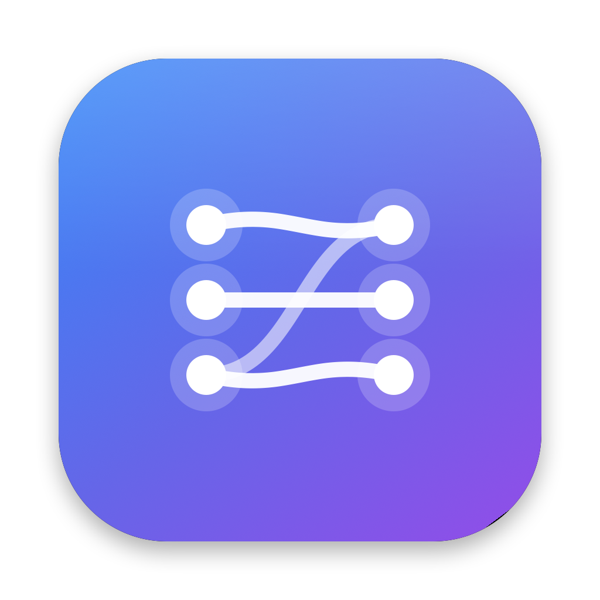

# Audeon



Audeon is a native macOS audio routing and monitoring app for streamers, gamers,
podcasters, and anyone who needs to send several audio sources to several
destinations at once. You build a routing matrix on a simple two column canvas,
set independent levels per route, and monitor everything live.

This is a standalone project. It is not related to, and shares no code with, any
other repository on this account.

## Why it exists

The idea is inspired by the kind of "draw a line from a source to a destination"
audio routers that exist on Windows, which have no Apple equivalent for casual
creators. Audeon rebuilds that workflow from scratch on top of Apple frameworks
(CoreAudio and AVAudioEngine for sound, SwiftUI for the interface), so it feels
at home on macOS with native menus, keyboard shortcuts, a menu bar control, and
automatic dark mode.

## The routing canvas

One canvas, the way the original works:

- Add input picks a source, which can be a capture device (a microphone or
  interface) or a running application. Each source becomes a card on the left.
- Add output picks an output device. Each becomes a card on the right.
- Drag from a source card's pin to an output card's pin to connect them, or click
  the source pin and then click an output pin. A cable is drawn and audio flows.
- Many to one is supported: several sources can feed one output, and one source
  can feed several outputs.

## Features

- Add device or application inputs, and output devices, on a single canvas.
- Drag a pin to an output to connect, or click one pin then the other.
- A real audio engine. Device sources run through an AVAudioEngine that wires the
  device to the chosen output with gain. Application sources are captured with a
  Core Audio process tap and replayed to the chosen output, so you can send one
  app to your headphones only.
- Per-card volume and mute for both inputs and outputs.
- Color customizable cards and cables, saved between launches.
- System default device pickers (Output, Input, Sound Effects) in Settings.
- Auto-detects running apps and refreshes the device list on hot plug.
- Native menus, a menu bar item, and automatic dark mode.

## Requirements

- macOS 14 (Sonoma) or later. Per-app redirect needs macOS 14.2 or later, since
  it relies on Core Audio process taps; the rest works on 14.0.
- The Swift toolchain (install Xcode, or the Command Line Tools with
  `xcode-select --install`).

## Install a release build

Releases ship a zipped `.app`. The build is ad hoc signed, not notarized, so
macOS quarantines it after download and a normal double click is refused. Open
Terminal and paste these commands to unzip it, clear the quarantine flag, and
launch it:

```bash
cd ~/Downloads
unzip -o Audeon-0.1.0-macos.zip
xattr -dr com.apple.quarantine Audeon.app
mv Audeon.app /Applications/
open /Applications/Audeon.app
```

If macOS still blocks it, run the binary directly to confirm it works:

```bash
/Applications/Audeon.app/Contents/MacOS/Audeon
```

If you would rather not use Terminal, unzip in Finder, right click Audeon.app,
choose Open, then confirm. You only need to do this once.

## Build and run from source

The easy path builds a real `.app` bundle, which is the most reliable way to get
the microphone permission prompt:

```bash
git clone https://github.com/muaz978/audeon.git
cd audeon
./scripts/build-app.sh
```

For an optimized build:

```bash
./scripts/build-app.sh release
```

For quick iteration during development:

```bash
swift build
swift run
```

You can also open the folder in Xcode (File > Open) and run the Audeon scheme.

On first launch macOS asks for microphone access, which is needed to read input
devices. If you miss the prompt, enable it under
System Settings > Privacy & Security > Microphone.

## How to use

1. Click Add input and pick a device or a running app. It appears as a card on
   the left.
2. Click Add output and pick an output device. It appears as a card on the right.
3. Drag from the source card's pin to the output card's pin to connect them, or
   click the source pin and then click an output pin. A cable is drawn and audio
   flows.
4. Connect as many cables as you like. Several inputs can feed one output.
5. Use each card's slider and mute button to set levels.
6. Set the system default Output, Input, and Sound Effects devices in Settings.

## Keyboard shortcuts

| Action | Shortcut |
|--------|----------|
| Settings | Cmd-, |
| Refresh Devices & Apps | Cmd-R |
| Disconnect All | Shift-Cmd-K |

## How it works

| File | Role |
|------|------|
| `Audio/AudioDeviceManager.swift` | CoreAudio device enumeration and a hot plug change listener |
| `Audio/AudioRouter.swift` | One AVAudioEngine per device-to-device route, with gain |
| `Audio/AppAudioManager.swift` | Auto-detects running apps via the Core Audio process object list |
| `Audio/AppRedirectEngine.swift` | Per app and output process tap, private aggregate device, gain passthrough |
| `Audio/SystemAudioController.swift` | Reads and sets the default Output, Input, and Sound Effects devices |
| `Audio/DeviceControls.swift` | Per-device volume and sample rate |
| `Models/GraphModels.swift` | Input sources, output targets, and connection value types |
| `Models/MixerStore.swift` | Graph state, persistence, drag-connect, and engine sync |
| `Models/Route.swift` | Route and color palette used by the device router |
| `Views/RoutingCanvasView.swift` | The canvas: Add input or output, cards, pins, and cables |
| `Views/ContentView.swift` | Window chrome and the menu button |
| `Views/SettingsView.swift` | Settings sheet with system default device pickers |
| `AudeonApp.swift` | App entry point, native menus, and the menu bar control |

The canvas (inputs, outputs, connections, and colors) is stored in
`~/Library/Application Support/Audeon/graph.json`.

## Roadmap

Done so far: device routing, per-app volume and redirect, system default device
pickers, per-device volume and sample rate, a menu bar control, and a settings
menu.

Still planned, in rough priority order. These are real subsystems, not faked
placeholders, which is why they are staged.

1. Per-app and per-device EQ and audio effects (a 10 band EQ and Audio Unit
   hosting). The path is to run the tapped audio through an AVAudioEngine graph
   with `AVAudioUnitEQ` and `AVAudioUnit` effects instead of the plain gain
   passthrough.
2. Volume boost above 100 percent, which is a software gain greater than one in
   the same passthrough.
3. Output Groups, so one app can play to several devices at once.
4. Present Audeon as a virtual device for OBS, Streamlabs, and Discord, via an
   AudioServerPlugIn driver or by supporting the open source BlackHole driver.
5. Super volume keys, so the media keys control the focused app or device.
6. Per-device nickname and custom icon.

## License

MIT. See `LICENSE`.
