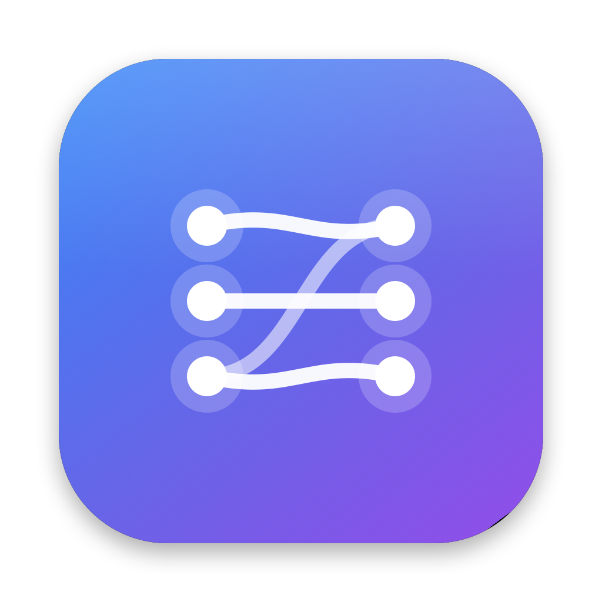

# Audeon



Audeon is a native macOS audio routing and monitoring app for streamers, gamers,
podcasters, and anyone who needs to send several audio sources to several
destinations at once. You build a routing matrix on a simple two column canvas,
set independent levels per route, and monitor everything live.

This is a standalone project. It is not related to, and shares no code with, any
other repository on this account.

## Why it exists

The idea is inspired by the kind of "draw a line from a source to a destination"
audio routers that exist on Windows, which have no Apple equivalent for casual
creators. Audeon rebuilds that workflow from scratch on top of Apple frameworks
(CoreAudio and AVAudioEngine for sound, SwiftUI for the interface), so it feels
at home on macOS with native menus, keyboard shortcuts, a menu bar control, and
automatic dark mode.

## The routing canvas

One canvas, the way the original works:

- Add input picks a source, which can be a capture device (a microphone or
  interface) or a running application. Each source becomes a card on the left.
- Add output picks an output device. Each becomes a card on the right.
- Drag from a source card's pin to an output card's pin to connect them, or click
  the source pin and then click an output pin. A cable is drawn and audio flows.
- Many to one is supported: several sources can feed one output, and one source
  can feed several outputs.

## Features

- Add device or application inputs, and output devices, on a single canvas.
- Drag a pin to an output to connect, or click one pin then the other.
- A real audio engine. Both device and application sources run through an
  AVAudioEngine with a 10 band EQ. Application sources are captured with a Core
  Audio process tap and replayed directly to the chosen output, so you can send
  one app to your headphones only.
- Per input volume, mute, a 1x to 4x volume boost, a 10 band EQ with presets,
  and Magic Boost, a dynamics compressor that lifts quiet audio and tames peaks.
- Per output volume and mute, and live level meters on cards and in the menu bar.
- Capture whole-system audio in one click: with the Audeon virtual driver (see
  `Driver/`) or the free BlackHole driver installed, "Capture system audio"
  funnels everything the Mac plays into one System Audio card, auto-routed to
  the speakers you were using, ready to fan out anywhere.
- Connect one input to several outputs. Each input lists its connected outputs,
  and you can disconnect any one of them from the card.
- Click a cable to delete just that connection.
- Drag inputs or outputs to reorder them.
- Scenes: save a whole routing setup and recall it in one click.
- Follow System Output: a source can track the default output automatically.
- Favorites, and hiding inactive applications.
- Color customizable cards and cables, with smooth animations, saved between
  launches.
- A tabbed Settings window: start at login, theme, system default devices,
  per-device nickname, volume, sample rate and channel mapping, and a cleanup
  tool for leftover capture devices.
- A menu bar popover with quick controls for every input and output, in full
  and compact layouts.
- A first run welcome screen that walks through permissions.

## Requirements

- macOS 14 (Sonoma) or later. Per-app redirect needs macOS 14.2 or later, since
  it relies on Core Audio process taps; the rest works on 14.0.
- The Swift toolchain (install Xcode, or the Command Line Tools with
  `xcode-select --install`).

## Install a release build

Releases ship a zipped `.app`. The build is ad hoc signed, not notarized, so
macOS quarantines it after download and a normal double click is refused. Open
Terminal and paste these commands to unzip it, clear the quarantine flag, and
launch it:

```bash
cd ~/Downloads
unzip -o Audeon-*-macos.zip
xattr -dr com.apple.quarantine Audeon.app
rm -rf /Applications/Audeon.app && mv Audeon.app /Applications/
open /Applications/Audeon.app
```

Because the build is ad hoc signed rather than notarized, there is no Apple
identity to check it against, so every release also ships a `SHA256SUMS.txt`.
Verifying against it is the one integrity check available:

```bash
cd ~/Downloads
shasum -a 256 -c SHA256SUMS.txt --ignore-missing
```

If macOS still blocks it, run the binary directly to confirm it works:

```bash
/Applications/Audeon.app/Contents/MacOS/Audeon
```

If you would rather not use Terminal, unzip in Finder, right click Audeon.app,
choose Open, then confirm. You only need to do this once.

## Build and run from source

The easy path builds a real `.app` bundle, which is the most reliable way to get
the microphone permission prompt:

```bash
git clone https://github.com/muaz978/audeon.git
cd audeon
./scripts/build-app.sh
```

For an optimized build:

```bash
./scripts/build-app.sh release
```

For quick iteration during development:

```bash
swift build
swift run
```

You can also open the folder in Xcode (File > Open) and run the Audeon scheme.

On first launch macOS asks for microphone access, which is needed to read input
devices. If you miss the prompt, enable it under
System Settings > Privacy & Security > Microphone.

## Tests

```bash
swift test
```

That runs the pure-logic suite: persistence and schema migration, restoring the
system output device, Output Group expansion, reordering, and the recording ring
buffer's wrap, rollover and concurrent-append behaviour.

The hardware suite is skipped unless you opt in:

```bash
AUDEON_HW_TESTS=1 swift test
```

Those tests build real routes through real Core Audio devices and record them.
They are deliberately silent -- every route runs between virtual devices, so
nothing reaches a speaker and the system's default output is never touched --
and they skip themselves if the Audeon driver is not installed. They need the
virtual driver plus one other virtual output (BlackHole works) to have something
to route between.

## Cutting a release

Both shipping artifacts are produced by the `Release` workflow, so a release is
a tag rather than a sequence of local build commands whose output nobody can
reproduce.

1. Bump `CFBundleShortVersionString` (and `CFBundleVersion`) in
   `Resources/Info.plist`, and merge that.
2. Tag the merge commit and push the tag:

   ```bash
   git tag v0.11.0 && git push origin v0.11.0
   ```

3. The workflow builds the universal `.app` and the universal driver on a clean
   runner, checks both are genuinely two-architecture, verifies the signatures
   survive being archived, writes `SHA256SUMS.txt`, and attaches all three to
   that tag's release.
4. Review the drafted notes and publish the release yourself. The workflow
   never publishes: release-drafter writes the notes as PRs merge, and pressing
   the button stays a human decision.

If the tag and `Info.plist` disagree about the version, step 3 fails
immediately and says which to change. That mismatch is the specific mistake
this is built to prevent, since it otherwise ships an app that misreports its
own version and is only noticed much later.

To exercise the whole build without cutting a release, run the workflow
manually (`Actions > Release > Run workflow`). It builds and verifies both
artifacts, uploads them as workflow artifacts, and touches no release.

The artifacts can also be built locally, which is what the workflow runs:

```bash
./scripts/package-app.sh      # dist/Audeon-<version>-macos.zip
./Driver/package-driver.sh    # Driver/dist/Audeon-Driver-macos.zip
```

## How to use

1. Click Add input and pick a device or a running app. It appears as a card on
   the left.
2. Click Add output and pick an output device. It appears as a card on the right.
3. Drag from the source card's pin to the output card's pin to connect them, or
   click the source pin and then click an output pin. A cable is drawn and audio
   flows.
4. Connect as many cables as you like. Several inputs can feed one output.
5. Use each card's slider and mute button to set levels, and the chevron for
   EQ, volume overdrive, and Magic Boost.
6. To grab everything the Mac plays at once, you need a virtual audio device.
   Two ways to get one:
   - Download `Audeon-Driver-macos.zip` from the latest release, unzip it, and
     run `sudo ./install.sh`. It is a universal (Apple Silicon and Intel)
     build. It is ad-hoc signed rather than notarized, so it loads on most
     Macs but a few with stricter or managed security may refuse it.
   - Or install the free, notarized BlackHole driver
     (https://existential.audio/blackhole/), which works everywhere.
   Then click Add input, then "Capture system audio". Quitting Audeon hands the
   system output back to your real speakers automatically.
7. Save the whole layout as a Scene and recall it any time.
8. Set the system default Output, Input, and Sound Effects devices in Settings.

## Keyboard shortcuts

| Action | Shortcut |
|--------|----------|
| Settings | Cmd-, |
| Refresh Devices & Apps | Cmd-R |
| Disconnect All | Shift-Cmd-K |

## How it works

| File | Role |
|------|------|
| `Audio/AudioDeviceManager.swift` | CoreAudio device enumeration and a hot plug change listener |
| `Audio/AudioRouter.swift` | Device-to-device routes: an AVAudioEngine for same-device, a direct I/O proc on a private aggregate for cross-device |
| `Audio/AudioRecording.swift` | Recording, buffered through a ring so the audio thread never touches the file |
| `Audio/CrossDeviceDSP.swift` | The manually rendered EQ/overdrive/Magic Boost chain used inside the cross-device I/O proc |
| `Audio/SinkGuard.swift` | Pins the capture sink at unity gain while system audio capture is on |
| `Audio/TestTone.swift` | Per-output test tone, for checking a device by ear in isolation |
| `Audio/AppAudioManager.swift` | Auto-detects running apps via the Core Audio process object list |
| `Audio/AppRedirectEngine.swift` | Per app and output process tap, private aggregate device, gain passthrough |
| `Audio/SystemAudioController.swift` | Reads and sets the default Output, Input, and Sound Effects devices |
| `Audio/DeviceControls.swift` | Per-device volume, sample rate, and stereo channel mapping |
| `Audio/AudioEQ.swift` | The shared 10 band EQ definitions and presets |
| `Audio/MagicBoost.swift` | The dynamics compressor behind Magic Boost |
| `Audio/AudioMeter.swift` | dBFS metering with clip detection and UI throttling |
| `Models/GraphModels.swift` | Input sources, output targets, and connection value types |
| `Models/MixerStore.swift` | Graph state, persistence, drag-connect, and engine sync |
| `Models/Route.swift` | Route and color palette used by the device router |
| `Views/RoutingCanvasView.swift` | The canvas: Add input or output, cards, pins, and cables |
| `Views/ContentView.swift` | Window chrome, the menu button, and the Scenes menu |
| `Views/SettingsView.swift` | Tabbed settings: general, devices, appearance, audio |
| `Views/OnboardingView.swift` | First run welcome and permissions screen |
| `Support/Hotkeys.swift` | The global show/hide shortcut and Super Volume Keys |
| `AudeonApp.swift` | App entry point, menus, and the menu bar popover |
| `Driver/` | The Audeon virtual audio driver (GPL-3.0, see its README) |

The canvas (inputs, outputs, connections, and colors) is stored in
`~/Library/Application Support/Audeon/graph.json`.

## Roadmap

Done so far: a Mixline style routing canvas (add input/output, click or drag to
connect, many to one and one to many), per-source and per-output volume and
mute, a 10 band EQ and 1x-4x volume overdrive per source, Magic Boost (a
dynamics compressor that lifts quiet audio and tames peaks), live level meters
on cards and in the menu bar, system default device pickers, per-device volume
and sample rate, scenes (save and recall a whole routing setup), follow system
output, a menu bar quick controls popover, a first run permissions screen, and
sleep/wake and device hot-plug resilience.

Known limitation: routing between two different physical devices (for example
a USB microphone to a separate set of speakers) uses a private aggregate
device combining the two, the same technique proven reliable for per-app
capture. In testing this surfaced a sample rate and channel count validation
issue in some configurations, which fails safely (a banner appears, no crash,
no audio glitch) but does not yet guarantee sound reaches the output. Routing
where the input and output are the same device, and all per-app capture and
redirect, are unaffected. This needs real-world listening verification, which
is tracked as the top priority below.

The virtual driver has shipped its first working stage: `Driver/` builds an
Audeon-branded AudioServerPlugIn (based on the BlackHole source, GPL-3.0)
that installs as an "Audeon Stream" device, with install, verify, and
one-command recovery scripts. The app detects it and uses it for one-click
system audio capture; OBS, Discord, and Zoom can select it directly. It is
ad hoc signed rather than notarized: the packaged installer clears the download
quarantine and it loads on most Macs, but a Mac under stricter or managed
policy can still refuse an un-notarized system driver, and fixing that needs an
Apple Developer membership.

The package builds in the **Swift 6 language mode**, so strict concurrency
checking is on for every target by default and the compiler rejects the class of
data race the reliability pass previously had to find by inspection. Getting
there took four passes and was worth more than the warning count suggests: the
diagnostics it turns into errors surfaced a use-after-free in the driver, a
recorder that could be fed by two audio threads at once, and a test tone whose
render block would abort the process the moment the audio thread called it.

Recent additions: cross-device hardware routes now run on a direct I/O proc
on the private aggregate (the lower-level primitive, replacing the fragile
shared-unit binding; gain and mute apply there, EQ and boost return to that
path later), Output Groups (one connection plays on several devices at once),
recording any routed source to a file in Music/Audeon Recordings, an opt-in
global show/hide shortcut (Option-Command-A) and opt-in Super Volume Keys
(Accessibility), per-device custom icons, and VoiceOver labels across the
canvas.

Both top roadmap items landed since: the full EQ, overdrive, and Magic Boost
chain now runs on cross-device routes too (a realtime manual-rendering
AVAudioEngine inside the I/O proc), and the whole pipeline is verified end to
end by machine: a generated tone is played into the virtual device, carried
across the aggregate route, and analyzed on the far side for frequency and
level (440 Hz in, 440 Hz out). That verification also uncovered and fixed the
real cause of silent capture: the virtual sink's own driver-level volume and
mute scale everything it stores, and the keyboard volume keys could zero them
while the sink was the default output. Audeon now pins the sink at unity gain
while capturing and guards it against outside changes, and every output card
has a test tone button so a device can be checked by ear in isolation.

A reliability pass has since gone through the whole codebase, fixing 80
verified defects. The ones worth knowing about: stopping a recording could
truncate it to a fraction of a second (the file is now opened once and written
from a dedicated thread, never from the audio callback); a bridge left on by an
abnormal quit was never re-adopted on the next launch, so the following quit
could leave the Mac with its output pointed at a sink nothing drains; engines
stopped by a sample-rate change were kept forever instead of rebuilt, which
silenced a redirected app everywhere rather than just in Audeon; the Settings
sheet had no way to close it; the maintenance button destroyed the aggregate
devices of every live route; and the driver had an out-of-bounds read on every
device creation plus a use-after-free in its realtime path, both reproduced
under sanitizers before being fixed. Route and tap startup also moved off the
main thread, so building a route no longer freezes the UI. CI now analyzes the
C driver and the shell scripts, which it never did before.

Still planned:

1. Verify the reliability pass on real hardware. The recorder rewrite and the
   newly asynchronous route startup are verified by sanitizers, static analysis
   and the driver test suite, but not yet by listening.
2. Sign and notarize the app and driver for one-click installs. Building and
   attaching the artifacts is now automated: tagging `vX.Y.Z` builds the
   universal app and driver on a clean runner, refuses to proceed if the tag
   and `Info.plist` disagree about the version, and attaches both plus
   `SHA256SUMS.txt` to that tag's draft release. Signing is the part that
   remains, and it needs a paid Apple Developer membership rather than more
   automation.

## License

The app is MIT licensed, see `LICENSE`. The virtual driver under `Driver/` is
GPL-3.0 because it builds on the BlackHole source; see `Driver/README.md`.
The app does not link against the driver, it only sees the resulting
CoreAudio device like any other.
